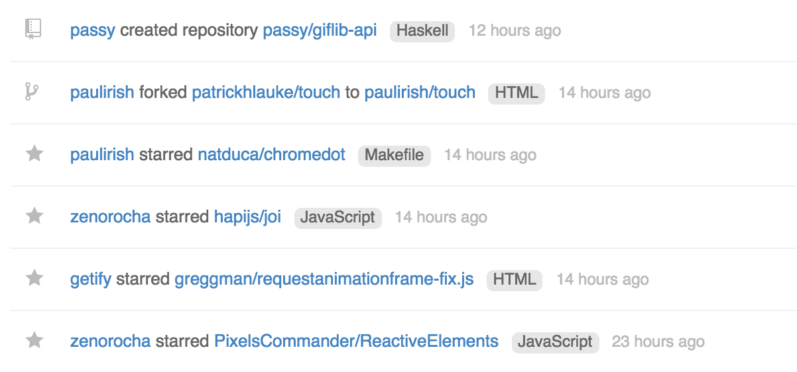

# github-language-mark
Show language of the repo on your feed.

## NOTE:
*This's a experimental project*, the way it's implemented is quite expensive because calling github API. It may reach your limitation of unauthenticated requests. [here are details](https://developer.github.com/v3/#rate-limiting)
